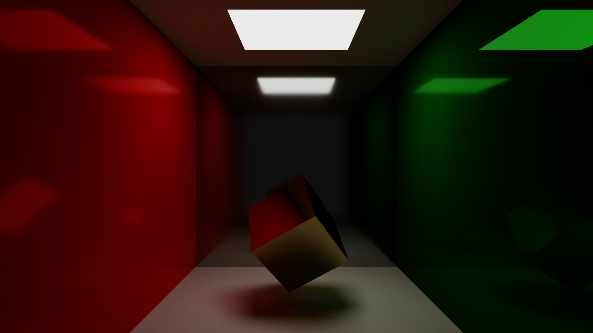

<h1 style="text-align: center; font-size:xx-large">KHJ's information</h1>

## About Me

|  이름  |  주소  | 생년월일 |
| :------: | :------: | :------: |
| 권혁진 | 경기도 성남시 | 1996.07.12 |
| 연락처 | 이메일 |   학력   |
| 010-4779-6077 | kwonhuckjin94@gmail.com | 서울대학교 컴퓨터 공학부 |

## Skills

- C
- C++
- python

- OpenGL

## Project

#### 0. Path tracing on GPU

**Keyword** : Path tracing, monte carlo integration, Importance sampling, PBR, BVH, CUDA

**Git repository** : [WaterPlease/PathTrace-on-CUDA (github.com)](https://github.com/WaterPlease/PathTrace-on-CUDA)

    
CUDA를 사용한 패스 트레이서입니다.

    

Features  
&nbsp;&nbsp;&nbsp;&nbsp;- PBR 
&nbsp;&nbsp;&nbsp;&nbsp;&nbsp;&nbsp;&nbsp;&nbsp; - Specular BRDF 
&nbsp;&nbsp;&nbsp;&nbsp;- Path tracing using Monte Carlo integration 
&nbsp;&nbsp;&nbsp;&nbsp;&nbsp;&nbsp;&nbsp;&nbsp; - Importance sampling 
&nbsp;&nbsp;&nbsp;&nbsp;- Next event estimation 
&nbsp;&nbsp;&nbsp;&nbsp;- Render on CUDA 
&nbsp;&nbsp;&nbsp;&nbsp;- Bounding Volume Hierarchy for accelerating ray intersection search 
    

TODO 
&nbsp;&nbsp;&nbsp;&nbsp;- Add refraction BRDF 
&nbsp;&nbsp;&nbsp;&nbsp;- Bidirection Path tracing 
&nbsp;&nbsp;&nbsp;&nbsp;- Fully working scene editor 
    

####     1. OpenGL toy project

**Keyword** : clustered deferred rendering, SSR, Shadow map, PCF, Bloom effect, PBR, Normal mapping, tessellation

**Detailed docs** : [doc (waterplease.github.io)](https://waterplease.github.io/OpenGL_TOY_PRJ/)

**Git repository** : [WaterPlease/OpenGL_TOY_PRJ (github.com)](https://github.com/WaterPlease/OpenGL_TOY_PRJ)

    
그래픽스 강의를 수강한 이후 관련 분야에 흥미가 생겨 더 공부해볼 목적으로 진행한 토이 프로젝트입니다. 흥미로운 기술들을 발견하면 공부하고 그것을 해당 프로젝트에 적용 시켜왔습니다.
이후에도 지속적으로 공부하면서 다양한 기능을 추가할 예정입니다.

    

Features  
&nbsp;&nbsp;&nbsp;&nbsp;- Clustered deffered rendering 
&nbsp;&nbsp;&nbsp;&nbsp;- Screen space reflection 
&nbsp;&nbsp;&nbsp;&nbsp;- Shadow mapping 
&nbsp;&nbsp;&nbsp;&nbsp;&nbsp;&nbsp;&nbsp;&nbsp;- jittered PCF with 64 samples at most. 
&nbsp;&nbsp;&nbsp;&nbsp;- HDR, gamma correction 
&nbsp;&nbsp;&nbsp;&nbsp;- Bloom effect 
&nbsp;&nbsp;&nbsp;&nbsp;- PBR 
&nbsp;&nbsp;&nbsp;&nbsp;- Normal mapping 
&nbsp;&nbsp;&nbsp;&nbsp;- tessellation 
&nbsp;&nbsp;&nbsp;&nbsp;- LOD 
&nbsp;&nbsp;&nbsp;&nbsp;- view cone culling 
    

#### 2. Unreal TPS Practice

**Keyword** : Unreal Engine 4, Inverse kinetics

**Git repository** : [WaterPlease/UnrealTPSPractice (github.com)](https://github.com/WaterPlease/UnrealTPSPractice)

    
언리얼 엔진을 이용해 만든 간단한 아레나 형식의 TPS 게임입니다. 다양한 게임들은 참고하여 필수적인 기능 위주로 구현하였습니다.

    

주요 기능  
&nbsp;&nbsp;&nbsp;&nbsp;- 스프레드 반응 크로스헤어 
&nbsp;&nbsp;&nbsp;&nbsp;- 3D UI 
&nbsp;&nbsp;&nbsp;&nbsp;- Inverse Kinetics 
&nbsp;&nbsp;&nbsp;&nbsp;&nbsp;&nbsp;&nbsp;&nbsp;- 지면에 반응하는 다리       &nbsp;&nbsp;&nbsp;&nbsp;&nbsp;&nbsp;&nbsp;&nbsp;- 총기에 따른 왼손의 위치 
&nbsp;&nbsp;&nbsp;&nbsp;- 원거리 적의 Deflection shooting 
    

####     3. 레이트레이싱

**Keyword** : BVH, 레이트레이싱, 멀티코어

**Detailed documentation** : https://github.com/WaterPlease/RAYTRACING/raw/main/HW5.pdf

**Git repository** :  [WaterPlease/RAYTRACING (github.com)](https://github.com/WaterPlease/RAYTRACING)

    
CPU 기반 레이 트레이서입니다.

그래픽스 강의 마지막 과제 결과물입니다. 한 학기 동안 배운 여러 내용과 과제 결과물을 기반으로 레이트레이서를 작성하였습니다. 때문에 한 학기 동안 그래픽스 강의를 들으며 학습한 여러 내용들을 재차 확인할 수 있었습니다. 또한 최적화를 위해 조사해보며 KD tree, Octree, bsp와 같은 공간분할 방법들을 익혀볼 수 있었습니다.

Features 
&nbsp;&nbsp;&nbsp;&nbsp;- BVH for acceleration 
&nbsp;&nbsp;&nbsp;&nbsp;- backward ray tracing 
&nbsp;&nbsp;&nbsp;&nbsp;&nbsp;&nbsp;&nbsp;&nbsp;- reflection 
&nbsp;&nbsp;&nbsp;&nbsp;&nbsp;&nbsp;&nbsp;&nbsp;- refraction 
&nbsp;&nbsp;&nbsp;&nbsp;&nbsp;&nbsp;&nbsp;&nbsp;- shadow 
&nbsp;&nbsp;&nbsp;&nbsp;&nbsp;&nbsp;&nbsp;&nbsp;- distributed raytracing 
&nbsp;&nbsp;&nbsp;&nbsp;&nbsp;&nbsp;&nbsp;&nbsp;&nbsp;&nbsp;&nbsp;&nbsp;- multisampling 
&nbsp;&nbsp;&nbsp;&nbsp;&nbsp;&nbsp;&nbsp;&nbsp;&nbsp;&nbsp;&nbsp;&nbsp;- soft shadow 
&nbsp;&nbsp;&nbsp;&nbsp;&nbsp;&nbsp;&nbsp;&nbsp;&nbsp;&nbsp;&nbsp;&nbsp;- rough mirror 
&nbsp;&nbsp;&nbsp;&nbsp;- .obj file import 
&nbsp;&nbsp;&nbsp;&nbsp;- scene import & viewer 
&nbsp;&nbsp;&nbsp;&nbsp;&nbsp;&nbsp;&nbsp;&nbsp;- swept surface 
&nbsp;&nbsp;&nbsp;&nbsp;&nbsp;&nbsp;&nbsp;&nbsp;&nbsp;&nbsp;&nbsp;&nbsp;- spline curve and bezier curve 
&nbsp;&nbsp;&nbsp;&nbsp;- phong illumination 
&nbsp;&nbsp;&nbsp;&nbsp;- multicore support 

