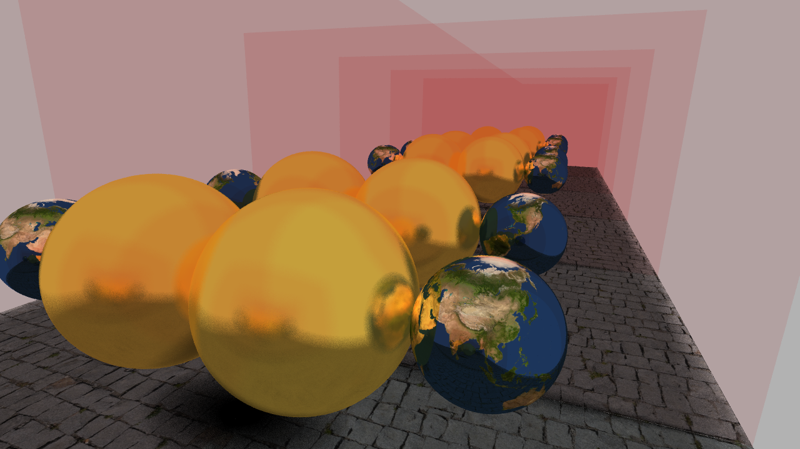
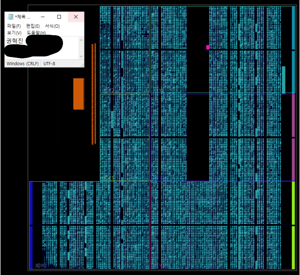
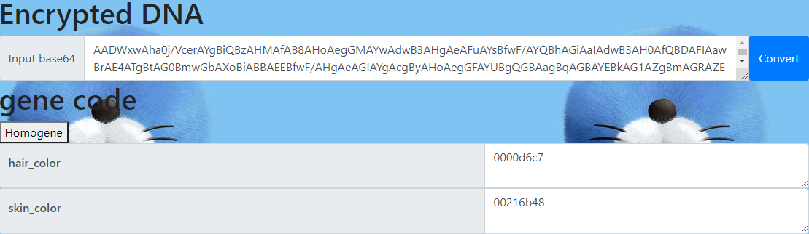
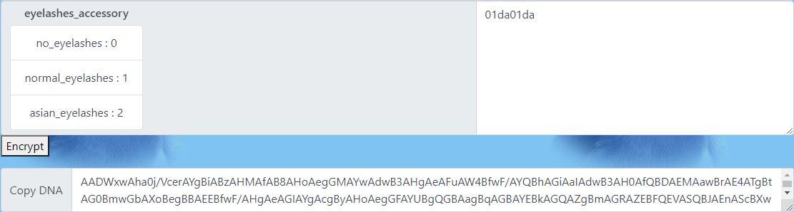

<h1 style="text-align: center; font-size:xx-large">KHJ's information</h1>

## About Me

|  이름  |  주소  | 생년월일 |
| :------: | :------: | :------: |
| 권혁진 | 경기도 성남시 | 1996.07.12 |
| 연락처 | 이메일 |   학력   |
| 010-4779-6077 | kwonhuckjin94@gmail.com | 서울대학교 컴퓨터 공학부 |

## Skills

- Langs
  - C
  - C++
  - python
- Stack
  - OpenGL

## Project

####     1. OpenGL toy project

**Keyword** : deffered rendering, shadow map, screen space reflection, PBR, tessellation

**Detailed docs** : [doc (waterplease.github.io)](https://waterplease.github.io/OpenGL_TOY_PRJ/)

**Git repository** : [WaterPlease/OpenGL_TOY_PRJ (github.com)](https://github.com/WaterPlease/OpenGL_TOY_PRJ)

    
설명

    

        그래픽스 강의를 수강한 이후 관련 분야에 흥미가 생겨 더 공부해볼 목적으로 진행한 토이 프로젝트입니다. 흥미로운 기술들을 발견하면 공부하고 그것을 해당 프로젝트에 적용 시켜왔습니다. 
이후에도 지속적으로 공부하면서 다양한 기능을 추가할 예정입니다.
    

    

Feature  
&nbsp;&nbsp;&nbsp;&nbsp;- Deffered rendering
&nbsp;&nbsp;&nbsp;&nbsp;- Screen space reflection
&nbsp;&nbsp;&nbsp;&nbsp;- Shadow mapping
&nbsp;&nbsp;&nbsp;&nbsp;&nbsp;&nbsp;&nbsp;&nbsp;- jittered PCF with 64 samples at most.
&nbsp;&nbsp;&nbsp;&nbsp;- Tone mapping, gamma correction
&nbsp;&nbsp;&nbsp;&nbsp;- Bloom effect
&nbsp;&nbsp;&nbsp;&nbsp;- PBR
&nbsp;&nbsp;&nbsp;&nbsp;- Normal mapping
&nbsp;&nbsp;&nbsp;&nbsp;- tessellation
&nbsp;&nbsp;&nbsp;&nbsp;- LOD
&nbsp;&nbsp;&nbsp;&nbsp;- view cone culling
    

####     2. 레이트레이싱

**Keyword** : BVH, 레이트레이싱, 멀티코어

**Detailed documentation** : https://github.com/WaterPlease/RAYTRACING/raw/main/HW5.pdf

**Git repository** :  [WaterPlease/RAYTRACING (github.com)](https://github.com/WaterPlease/RAYTRACING)

    
설명

그래픽스 강의 마지막 과제 결과물입니다. 한 학기 동안 배운 여러 내용과 과제 결과물을 기반으로 레이트레이서를 작성하였습니다. 때문에 한 학기 동안 그래픽스 강의를 들으며 학습한 여러 내용들을 재차 확인할 수 있었습니다. 또한 최적화를 위해 조사해보며 KD tree, Octree, bsp와 같은 공간분할 방법들을 익혀볼 수 있었습니다.

Feature 
&nbsp;&nbsp;&nbsp;&nbsp;- BVH for acceleration
&nbsp;&nbsp;&nbsp;&nbsp;- backward ray tracing
&nbsp;&nbsp;&nbsp;&nbsp;&nbsp;&nbsp;&nbsp;&nbsp;- reflection<
&nbsp;&nbsp;&nbsp;&nbsp;&nbsp;&nbsp;&nbsp;&nbsp;- refraction
&nbsp;&nbsp;&nbsp;&nbsp;&nbsp;&nbsp;&nbsp;&nbsp;- shadow
&nbsp;&nbsp;&nbsp;&nbsp;&nbsp;&nbsp;&nbsp;&nbsp;- distributed raytracing
&nbsp;&nbsp;&nbsp;&nbsp;&nbsp;&nbsp;&nbsp;&nbsp;&nbsp;&nbsp;&nbsp;&nbsp;- multisampling
&nbsp;&nbsp;&nbsp;&nbsp;&nbsp;&nbsp;&nbsp;&nbsp;&nbsp;&nbsp;&nbsp;&nbsp;- soft shadow
&nbsp;&nbsp;&nbsp;&nbsp;&nbsp;&nbsp;&nbsp;&nbsp;&nbsp;&nbsp;&nbsp;&nbsp;- rough mirror
&nbsp;&nbsp;&nbsp;&nbsp;- .obj file import
&nbsp;&nbsp;&nbsp;&nbsp;- scene import & viewer
&nbsp;&nbsp;&nbsp;&nbsp;&nbsp;&nbsp;&nbsp;&nbsp;- swept surface
&nbsp;&nbsp;&nbsp;&nbsp;&nbsp;&nbsp;&nbsp;&nbsp;&nbsp;&nbsp;&nbsp;&nbsp;- spline curve and bezier curve
&nbsp;&nbsp;&nbsp;&nbsp;- phong illumination
&nbsp;&nbsp;&nbsp;&nbsp;- multicore support

#### 3. Matrix multiplication accelerator on FPGA

**Git repository** : [sdasd-asdsad/prj_v0 (github.com)](https://github.com/sdasd-asdsad/prj_v0#mlp1)

**keyword** : verilog, MLP, matrix multiplication

하드웨어 설계 강의 학기 팀 프로젝트입니다. MLP 연산 가속을 위한 하드웨어를 설계 및 소프트웨어에 적용하는 것을 목표로 진행한 프로젝트입니다.

담당한 부분

1. 대부분의 하드웨어 코드 작성
   - 두 floating point 값의 곱을 제외한 모든 코드 작성
2. transforming convolution into matrix multiplication
3. support hardware acceleration for matrix multiplication

####     4. CK3 DNA Editor on web

link : https://sdasd-asdsad.github.io/CK3DNA_Edit/

- Keyword : base64

    
접기/펼치기

크루세이더 킹즈3의 캐릭터 외형 수정을 위한 DNA 에디터 입니다.

